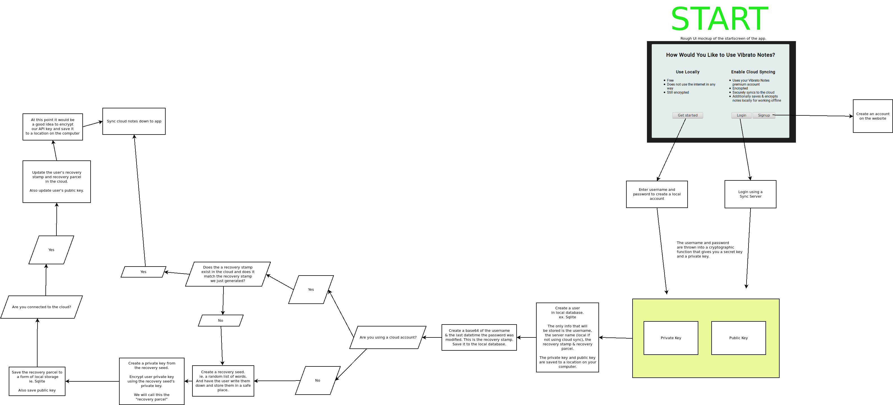

# Vibrato Technical Diagrams

This repository is to store all sorts of technical diagrams having to do with Vibrato Notes.

## Generating Keys

This first diagram details the basics of the cryptography used when you first set up Vibrato Notes.

It does not cover encrypting notes/notebooks/tags.

It all starts at the splashscreen when you open Vibrato Notes for the first time.

Start reading at the big "START" label and follow the arrows around the diagram.

This diagram shows how notes, notebooks and tags are encrypted. It also explains how these objects could be shared among users.
